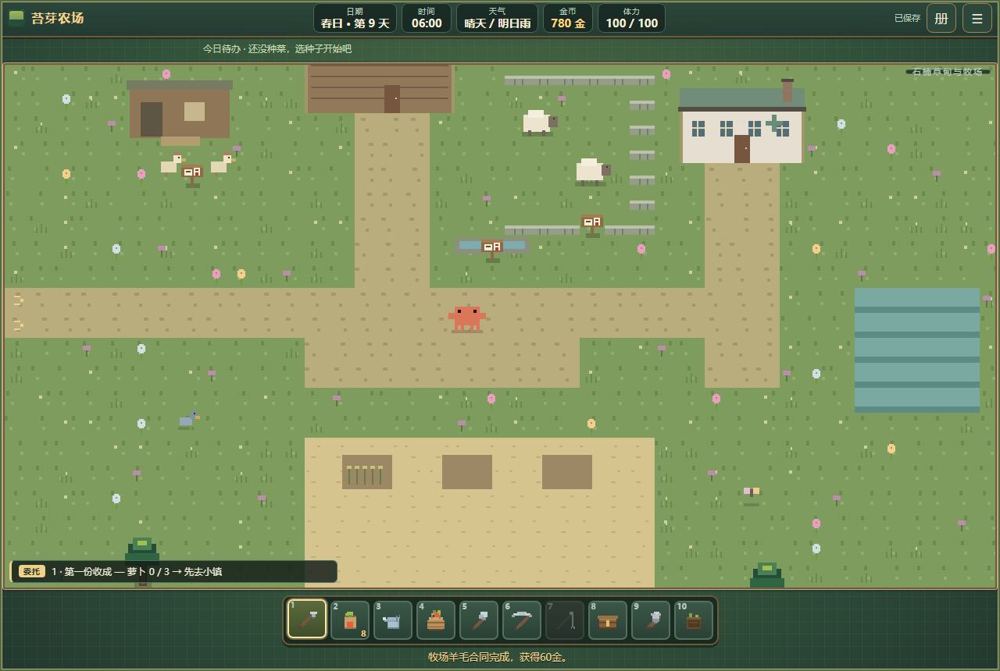
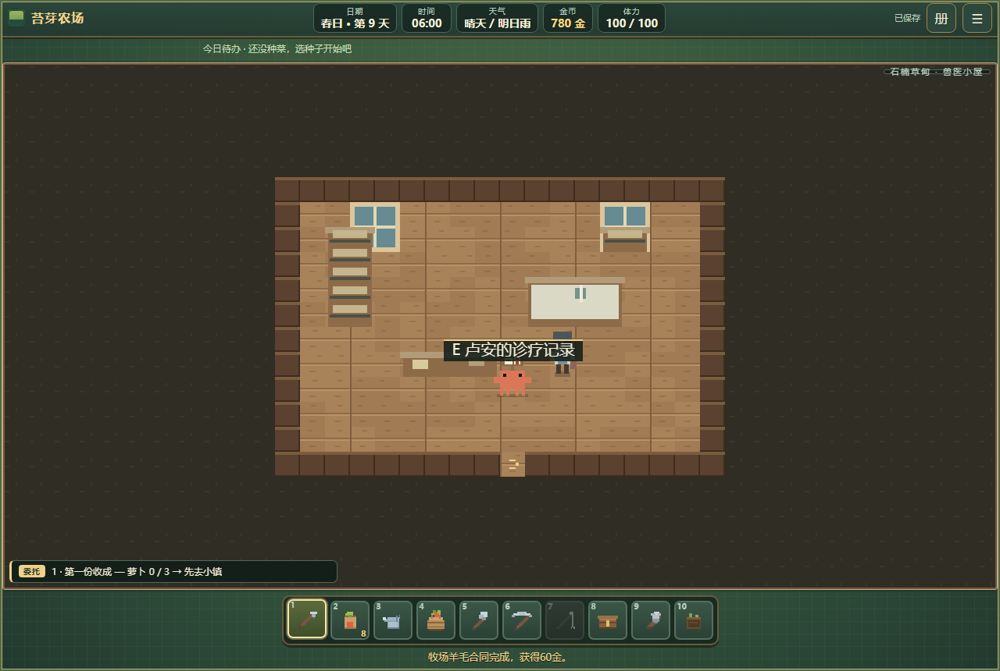
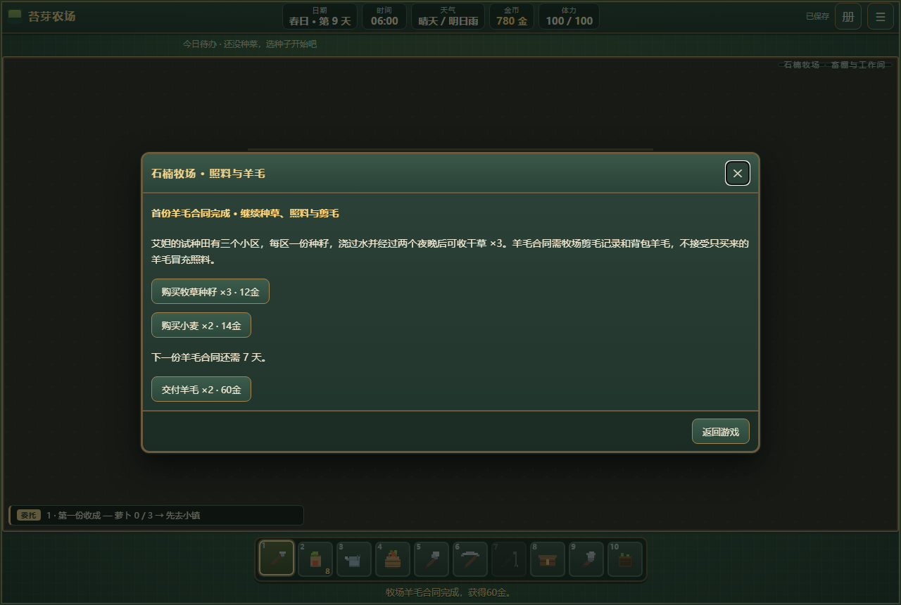

# 阶段 C：石楠草甸与牧场

2026-10-09，推进基线 origin/main cf3985b。C 两个优先区域（磨坊／麦田村、草甸／牧场）已达到首批退出条件；湿地可选扩展尚未接入。

## 如何进入

在小镇西侧 (2,18) 路牌旁按 E，可直接步行前往草甸，无军事或职业资格要求。首次到访登记后可用 M／手机地图传送；草甸返小镇 10 分钟、农场 30、森林 30、磨坊 60、城市 60。地图显示室内属于草甸。N 记录、J 委托都有牧场事务入口；设施操作仍要求站在旁边。

草甸 44×34 格，低石墙羊栏、公共饮水槽、鸡舍、三块试种田、适量花草树木与两只羊。畜棚工作间门 (15,10)、兽医小屋门 (29,12) 均可进入，有粮袋、工作台、柜架、诊疗床、药柜、记录桌及真实碰撞。牧场主艾妲、兽医卢安有独立服装、对话、日程和事务入口。

## 主线与可重复活动

1. 饮水槽 (19,15)：检查 10 分钟、2 体力；修补木材 6＋石头 8，40 分钟、6 体力。修好后水槽出现清水。
2. 羊栏门 (23,14)：观察新羊 10 分钟、2 体力；兽医室内记录点 (9,7) 学习照料 15 分钟。
3. 修槽、观察、学习后，每个游戏日在羊栏喂小麦或干草一份，10 分钟、2 体力。两个不同日照料且当天已喂养才可首次剪毛。
4. 剪毛 20 分钟、4 体力，真实产羊毛 ×2，记日期和来源资格。以后每三天可剪一次，仍要求当天喂养。
5. 畜棚工作台 (8,7)：首次合同交羊毛 ×2，获得 60 金、艾妲好感 5。需要尚未交付的牧场剪毛记录，不能只买羊毛绕过学习；七天后可交下一份合同。
6. 试种田 (14,24)、(18,24)、(22,24)：一份种籽播种，10 分钟、2 体力；每次浇水 5 分钟、2 体力。经过两个浇过水的游戏夜晚后割草 15 分钟、3 体力，产干草 ×3，腾空后可重种。雨天自动计入正常夜结算，成熟草无需继续浇水；画面显示空土、嫩草、成熟、干湿状态。畜棚卖种籽三份 12 金、补给小麦两份 14 金。
7. 鸡舍 (7,12)：修好饮水槽后喂小麦一份，5 分钟、1 体力，隔夜可收蛋 ×2（5 分钟）。领取后才能安排下一轮饲料，不无限积蛋。

照料账本保存最近 32 个喂养日，另存剪毛总产出、已交付量、剪毛与合同日期、鸡舍喂粮与领蛋日期、三个试种田的种植和浇水日。地点切换、重载或传送均不提前成熟、刷新周期或重复发奖。旧档缺字段补默认值。材料、金币、耗时、体力及扣料后的背包空间先校验，拒绝操作不扣资源。

## 验收证据

运行 node tests/run-phase-c-meadow.mjs：68/68。包含方向键步行与 E 进屋和设施操作、真实家具碰撞、两次正常夜结算、干草替代粮食、重复喂养与剪毛拒绝、满包不消耗剪毛周期、三天剪毛／七天合同周期、雨夜生长、鸡舍隔夜与一次领取、存档重载、N 记录和地图、手机触屏操作与返家。用夹具安排材料、边界体力／时间与雨天，不把这些称为全程自然解锁。

另重跑磨坊 55/55、UI 96/96、传送 56/56、地图 20/20、单文件 11/11、旧农务／矿山链 33/33，合计 339 项；控制台零错误。手机为 844×390、390×844 触屏模拟，尚未进行实体设备性能验收。下载单文件已重新构建，与源码同步。

草甸羊栏是学习照料的公共牧场，与玩家农舍鸡羊畜养账本独立；不会把牧场动物误算成玩家购买的牲畜。湿地、职业晋升、属性天赋、军队与新年历尚未实现。
