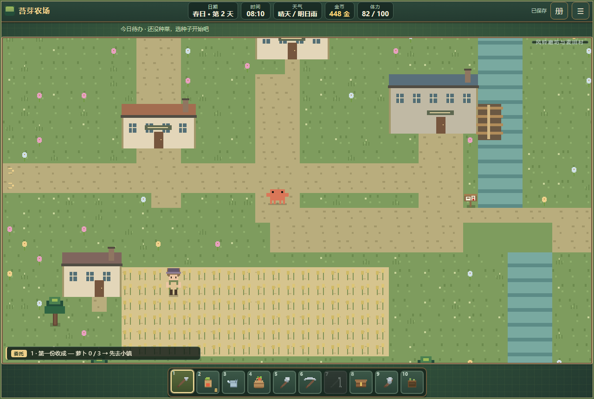
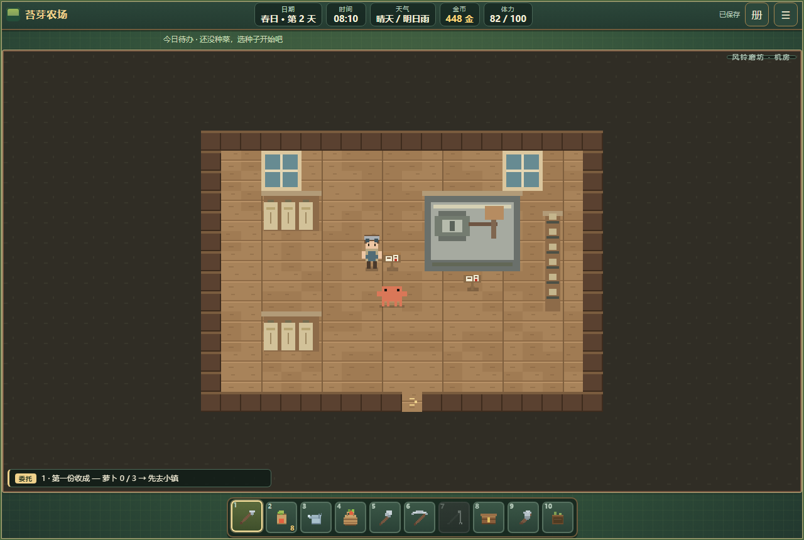
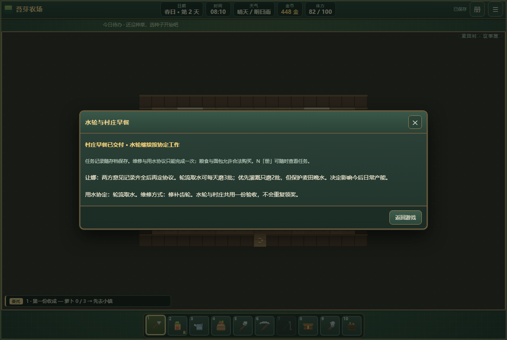

# 阶段 C：风铃磨坊与麦田村

日期：2026-10-09。推进基线：origin/main 09e0ef6。C 首个区域完成，其他 C 区域尚未完成。

## 进入与空间

修桥后，站在小镇 (22,22) 路牌旁按 E。村庄 48×36 格，有河渠、可走桥面、麦田和低矮乡村建筑。三间重要建筑可进入：磨坊机房 (29,16)、面包房 (10,17)、议事屋 (19,11)。室内设磨石、传动设备、粮袋、烤炉、操作台、桌椅与告示，家具实际阻挡行走，出口返回对应门前。装饰民居没有承诺开放室内，麦田是村民农务背景，不是玩家种植区。

四名 NPC：磨坊师马丁、面包师艾莉丝、议事员让娜、农夫阿贝尔。事务可从 N 记录或 J 委托进入，但实际操作必须站在设施旁。

## 可玩任务链

1. 进水渠 (31,20) 与机房齿轮 (13,7) 各调查 10 分钟、2 体力。
2. 机房操作点 (9,6) 维修：铁件方案木材 8＋铁矿 1，45 分钟、8 体力；木桨方案木材 12＋石头 6，60 分钟、8 体力。无铁矿也能完成。
3. 村中农夫意见点 (11,25)、面包房意见点 (9,6) 各 10 分钟，之后在议事屋 (9,5) 协商 15 分钟。均衡用水每日可磨三批，优先灌溉每日两批。
4. 机房开始试转 20 分钟、3 体力，正常睡觉跨日后才能验收（10 分钟、2 体力）；奖励 90 金与马丁好感 5，仅一次。验收后水轮会转动。
5. 村麦仓每天最多买 6 份：每次粮食 2 份、14 金。磨粉每批粮食 2→面粉 3，30 分钟、4 体力，受用水方案日额度约束。面包房面粉 1→可食面包 2，30 分钟、4 体力。
6. 面包房 (5,7) 交付早餐面包 2，奖励 50 金与艾莉丝好感 5，仅一次。完成后生产可继续。

每一步校验真实位置、先决条件、完整耗时、体力、材料、金币与扣料后的背包容量，失败不扣资源。维修、协商和奖励防重复；库存、产能、方案及任务状态写入存档，重载或传送不能刷新每日额度。旧档缺字段使用默认值。

首次实际入村登记传送；机房、面包房、议事屋在世界地图归属麦田村。小镇往返 30 分钟、河湾 10、城市 30、农场 60，沿用统一传送与安全落点检查。

## 实际验收

运行 node tests/run-phase-c-mill.mjs：55/55。包含真实方向键步行和 E 操作、正常夜结算、双维修方案、用水方案、满包及晚间拒绝不扣资源、每日库存与加工限额、一次性奖励、存档重载、室内地图、触屏传送。用夹具安排桥梁解锁、材料和时间边界，不称为从新档自然游玩到所有解锁。

另重跑：B 基线 22/22、UI 96/96、传送 56/56、地图 19/19、单文件 11/11，共 259 项。手机采用 844×390、390×844 触屏模拟，没有实体手机性能结论。

## 剩余范围

石楠草甸及其他 C 区域仍待建设；职业晋升、军队与新年历仍是后续阶段。独立果树种植也尚未完成，已有果酱加工不能作为果园验收。
